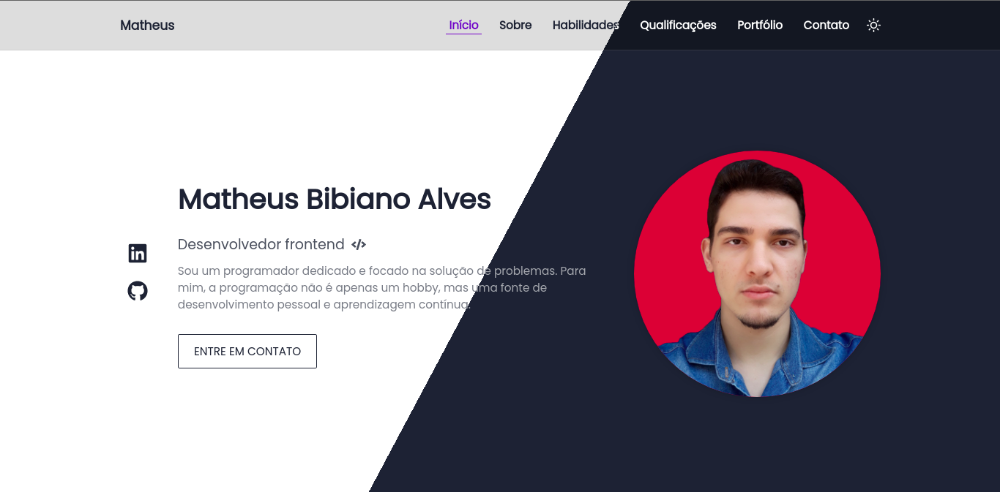

# PORTFÓLIO

### Sobre

O objetivo deste projeto é desenvolver um portfólio pessoal utilizando meus conhecimento em programação web, incluindo o uso de um framework JavaScript ⚛.


<br/>

### 📌 Conteúdo

* [Sobre](#sobre)
* [Status](#status)
* [Características](#características)
* [Requisitos](#requisitos)
* [Tecnologias](#tecnologias)
* [Referências](#referências)
* [Autor](#autor)
* [Licença](#licença)
<br/>

### Status

Projeto em construção 🛠️
<br/>

### Características

- [x] Página **Início**
- [x] Página **Sobre**
- [x] Página **Habilidades**
- [x] Página **Qualificações**
- [x] Página **Portfóli**
- [x] Página **Contato**
- [x] Mudança de tema
<br/>

### Requisitos

1. Para rodar a aplicação é necessário a instalação do [Node.js](https://nodejs.org/).

2. O próximo passo é clonar este repositório para algum local do computador
por meio do terminal ou cmd:

```bash
    $ git clone https://github.com/MatheusBibiano/Portfolio.git
```

3. Feito isso, navegue para dentro da pasta do projeto e instale as dependências:

* Linux & Windows
```bash
    $ npm install
```

4. Após concluir a instalação, crie, na raiz do projeto, um arquivo **.env** onde ficarão armazenadas as variáveis de ambiente e adicione os valores às chaves de acordo com seu projeto supabase:

Arquivo .env
```js
    REACT_APP_SUPABASE_URL=""
    REACT_APP_SUPABASE_ANON_KEY=""
```

5. Na plataforma da Supabase, uma tabla com os seguntes atributos:
```bash
    contact -> {
        id(int8)
        author(text)
        email(text)
        subject(text)
        message(text)
        data(text)
    }
```

4. Por fim, execute a aplicação:

* Linux & Windows
```bash
    $ npm start
```
<br/>

### Tecnologias

As seguintes tecnologias foram utilizadas na construção do projeto:

- [Node.js](https://nodejs.org/)
- [HTML5](https://developer.mozilla.org/docs/Web/HTML)
- [CSS3](https://developer.mozilla.org/docs/Web/CSS)
- [Javascript](https://developer.mozilla.org/docs/Web/JavaScript)
- [ReactJS](https://pt-br.reactjs.org/)
- [Supabase](https://supabase.com/)
<br/>

### Referências
Design utilizado: [Responsive Personal Portfolio Website Using HTML CSS And JavaScript | Dark/Light Mode](https://www.youtube.com/watch?v=27JtRAI3QO8)
<br/>

### Autor

| Matheus Bibiano                                       |
|-------------------------------------------------------|
| |
| [](https://www.linkedin.com/in/matheus-bibiano-alves)|
<br/>

### Licença

[MIT](https://choosealicense.com/licenses/mit/)

